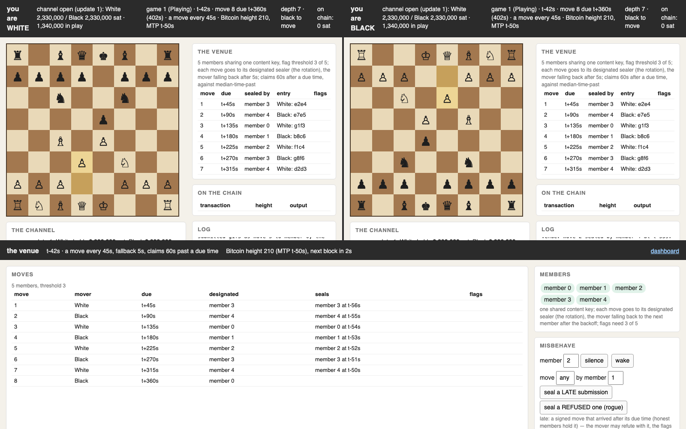
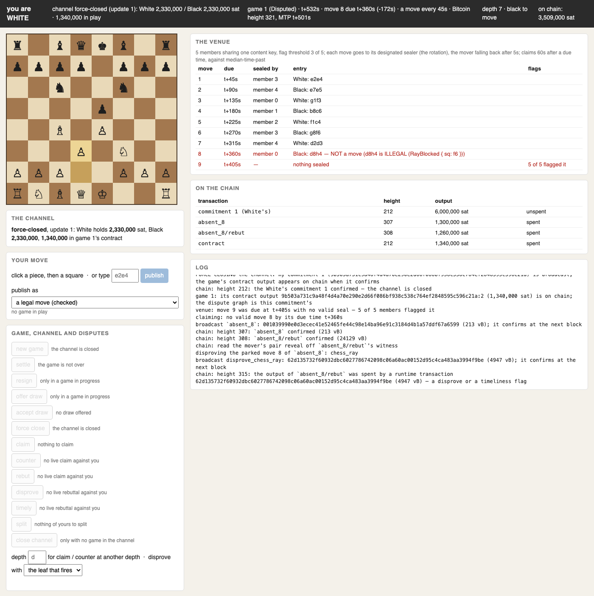
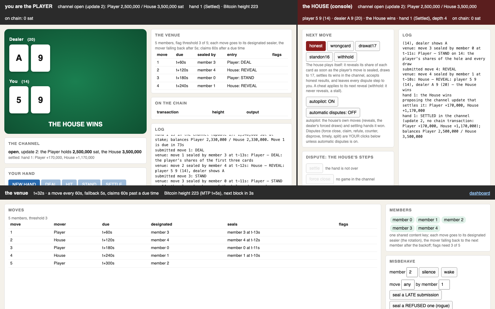

# LN-GAP — Lightning Network Governed by Arbitrary Programs

### Preliminary note:

This codebase is AI-generated; the "short paper" linked in the intro is where I would start, and is written by me. As is much of this README, so I would suggest order of ingestion is: first half of README, then short paper, then second half of README leads you through how to run the demos to see it in action. Then if you want to dive deeper, go into docs/ and look through the explainers of the Script and cryptography mechanics being used.

## Introduction

This is a big set of ideas put together, so, to keep it simple: minimize the onscript footprint of disputes in bilateral contracts over some state by publishing updates ("moves") before a time deadline. This enables things like chess (programs whose internal state is a bit too large to dispute directly onchain) as well as things like service provider contractual relationships and even ZKP verification (with a bisection style proof of the verification passing done *off*-chain).

All of this is dependent on what's called a **venue**, which is a set trusted only for one thing: validating that an arbitrary string is published in-time.

For the actual whole argument, read the [short paper](docs/paper/lngap-short.pdf) to get the general structure and motivation. An AI-authored much more detailed paper is [also available](docs/paper/lngap_draft.pdf ) and can also be used to dive in further.

For diagram-led explanations of the key mechanics (how a game rule is tested in Script, the one-time signatures, the venue's attestations, the pre-signed dispute graph), see [docs/](docs/README.md).

## Caveat

The code here is intended as a proof-of-concept. It is not fit for any kind of production use with real money.

(It's also worth mentioning that, while the demos are fully functional, as you'll see, some peripheral parts of the design are simply not built, for example fidelity bonds, venue fee payments amongst others).

The demos use a venue of 5 members, no larger roster to choose from; there is only one channel between the two players, and therefore no routing, as would be needed for the aforementioned fees. Bitcoin transaction fees, including the deposit outputs that make them fair, *are* built.

## Repository layout

The current design is under `crates/`; earlier iterations are under
[`archive/`](archive/README.md).

| crate | role |
|---|---|
| `crates/apps/pos` | the venue (sealing, flags, the registry), the dispute graph and the disprove families for tic-tac-toe, chess and blackjack |
| `crates/apps/demo`, `chess-venue`, `blackjack-venue` | the browser demos: a shared channel-and-venue layer, and the two games |
| `crates/apps/zk` | a disputed computation (BitVMX's search) played as a venue game, up to a Groth16 verifier |
| `crates/channel` | a Poon-Dryja channel whose commitments carry contract outputs and their pre-signed graphs |
| `crates/ec-wots` | EC-OTS: the venue's anticipation-point tables, flags, and the fee lock's adaptor |
| `crates/lamport` | Winternitz and Lamport one-time signatures, and their Script verifiers |
| `crates/btc`, `crates/script32` | Bitcoin plumbing (keys, taproot trees, regtest), and a Script simulator for testing leaves |
| `crates/apps/chess`, `tictactoe`, `blackjack` | the games' rules, kept independent of the dispute machinery |
| `crates/harness` | regtest test worlds and scenario suites (`pos_*` and `fee_lock` are current; the rest exercise older designs) |

Some crates date from the earlier proof-of-work design but remain
dependencies of the current one: `factchain` (the venue still uses its
header and head formats), `contract` (outcomes and shared leaf builders),
`chess-fc` (the chess state encoding) and `n4bit` (a Script-friendly hash).

## Building

The proof of concept is a Rust workspace. You need:

- **Rust**, a recent stable toolchain via [rustup](https://rustup.rs)
  (tested with 1.96);
- **a C compiler** (`cc`/`clang`/`gcc`): the `secp256k1` crate builds
  libsecp256k1 from source;
- **Bitcoin Core** (`bitcoind`), to run the demos and the regtest tests
  (tested with v31). It must be on your `PATH`, or set `LNGAP_BITCOIND`
  to the binary's path;
- **network access to GitHub** on the first build: the zero-knowledge crate
  (`lngap-zk`) depends on BitVMX's repositories by git, and Cargo fetches
  every git dependency in the workspace even when you build only the demos.

Clone and build the two demo binaries in release mode:

    git clone https://github.com/AdamISZ/ln-gap
    cd ln-gap
    cargo build --release -p lngap-chess-venue -p lngap-blackjack-venue

The binaries are `target/release/lngap-chess-venue` and
`target/release/lngap-blackjack-venue`. Use release builds for the demos:
building a game's pre-signed transaction graph is much slower in a debug
build.

`cargo build --release` builds the whole workspace instead, including the
test harness and the zero-knowledge tools.

### Running the tests

The tests start their own throwaway regtest nodes, so they also need
`bitcoind`. For the dispute graphs of the PoS venue (tic-tac-toe, chess,
blackjack, the channel), and the scenario suites:

    cargo test -p lngap-pos
    cargo test -p lngap-harness --test pos_stall --test pos_chess --test fee_lock -- --test-threads=2

Limit the harness to two threads: each test drives its own node, and more
in parallel mainly costs CPU. The zero-knowledge tests run with
`cargo test -p lngap-zk --release`. The tests against the real Groth16
verifier are opt-in; see *Disputed computation* below.

## Running the demos

There are two browser demos, chess and blackjack. Both run on a local
Bitcoin regtest network. Each demo is three processes on your machine:

- the **venue**: the committee of five members that seals moves and flags
  missing ones, plus a private regtest `bitcoind` that mines a block every
  20 seconds;
- two **parties**, each with its own web page. The parties open a real
  Lightning-style channel with each other, then play inside it.

Nothing touches mainnet, testnet or signet.

### Requirements

- Bitcoin Core's `bitcoind` on your `PATH`, or set `LNGAP_BITCOIND` to the
  binary's path.
- The release binaries `target/release/lngap-chess-venue` and
  `target/release/lngap-blackjack-venue` (see *Building*).
- A browser. Everything is served on `127.0.0.1`.

### Chess

Open three terminals in the repository root and start the venue first:

    target/release/lngap-chess-venue venue --web 8090
    target/release/lngap-chess-venue play white --web 8091
    target/release/lngap-chess-venue play black --web 8092

The players fund and open their channel by themselves; wait until both
terminals print `the channel is open`. Then browse:

- <http://127.0.0.1:8090/dashboard>: White, Black and the venue on one
  screen (the easiest way to follow a game);
- or each page on its own: White on 8091, Black on 8092, the venue on 8090.

*The dashboard seven moves into a game: White (left) and Black (right),
each with its board, its view of the venue's seals and its channel; below,
the venue's record of each move, its designated sealer and its seal, and
the controls for making members misbehave.*

On White's page, **new game** puts each side's stake and dispute deposit
into the channel. Then play by clicking pieces on the board. Each move has a
time window (90 seconds by default), and a game is at most 50 moves
(counting both sides' moves); a game that reaches the limit without a mate
is a draw. Games end in the channel with no Bitcoin transaction: the winner
**settles** a mate, either side can **resign**, and **offer draw** /
**accept draw** split the pot.

To see a dispute, misbehave:

- **On a player's page**, the move menu offers dishonest moves: an illegal
  move, a garbage-signed move, a malformed one, one signed for the wrong
  move number, or a late one. You can also simply stop moving.
- **On the venue's page**, you can silence or wake members, make a member
  seal a move late, have a rogue member seal an unsigned entry, or mine a
  block at once.

A game with no agreed result goes on chain by force-close. The pages then
offer each dispute step (claim, counter, rebut, disprove, timely, split)
as a button, and the log narrates who wins and why.

*White's page after a dispute. Black's move 8 (the queen from d8 to h4,
through its own knight on f6) was signed and sealed, but is illegal. White
force-closed the channel and claimed that no valid move 8 was made; Black
rebutted with the sealed move, putting it on chain; White disproved it with
the one leaf it breaks (`chess_ray`) and took the pot. Three transactions
after the commitment, whatever the length of the game.*

### Blackjack

The same three processes, with the roles `player` and `house`:

    target/release/lngap-blackjack-venue venue --web 8090
    target/release/lngap-blackjack-venue play player --web 8091
    target/release/lngap-blackjack-venue play house --web 8092

Browse the dashboard at <http://127.0.0.1:8090/dashboard>, or the player
on 8091 and the house on 8092.

The player starts each hand with **new hand**, then **deal**, **hit** and
**stand**. The house plays itself (its *autopilot*): it reveals its share of
each card, draws to 17 as the dealer, and settles hands it won. Honest
hands settle in the channel with no Bitcoin transaction, so you can play
several in a row.

*A hand settled in the channel: the player stood on 14, the dealer drew to
20, and the house's winnings moved by a channel update, with nothing on
chain. The house's page (right) has the cheat menu and the autopilot
switches.*

On the house's page you can make the house cheat on its next reveal: a
wrong card, drawing past 17, standing below 17, or **withhold**, which
never reveals and so stalls. The dispute steps are then buttons on the
pages, or automatic if you switch on **automatic disputes**.

### Options and housekeeping

- `--ell S` sets the seconds per move, and `--max-depth M` the move limit
  (on the `venue` command). `--deposit SAT` sets each side's dispute
  deposit. `--dir D` sets the working directory (default `./chess-venue`
  or `./blackjack-venue`); use a different one to run both demos at once.
  Run either binary with no arguments for the full list.
- Every venue start is fresh: it wipes the directory's previous games and
  starts a new regtest chain.
- Stop the demo with Ctrl-C in each terminal. The venue's `bitcoind` can
  outlive it; starting the venue again in the same directory shuts the old
  node down.
- The parties can also run without `--web`, taking typed commands in the
  terminal instead.

### Disputed computation (zero knowledge)

The `lngap-zk` crate plays BitVMX's search over a RISC-V program's
execution as a game on the venue, with only the one disputed step settled
on chain. With `bitcoind` available, a narrated dispute over a small
vendored program runs straight from the build:

    cargo run --release -p lngap-zk --bin lngap-zk-demo -- hello honest
    cargo run --release -p lngap-zk --bin lngap-zk-demo -- hello fake 600
    cargo run --release -p lngap-zk --bin lngap-zk-demo -- hello bad-input

The paper's headline example disputes BitVMX's **Groth16 verifier** checking
a real RISC Zero proof (about 479 million steps). Its verifier program is
GPL-3.0 and isn't included here, so a script assembles it, a sample proof
and a small parameter patch on your own machine; see
[`crates/apps/zk/GROTH16.md`](crates/apps/zk/GROTH16.md).

