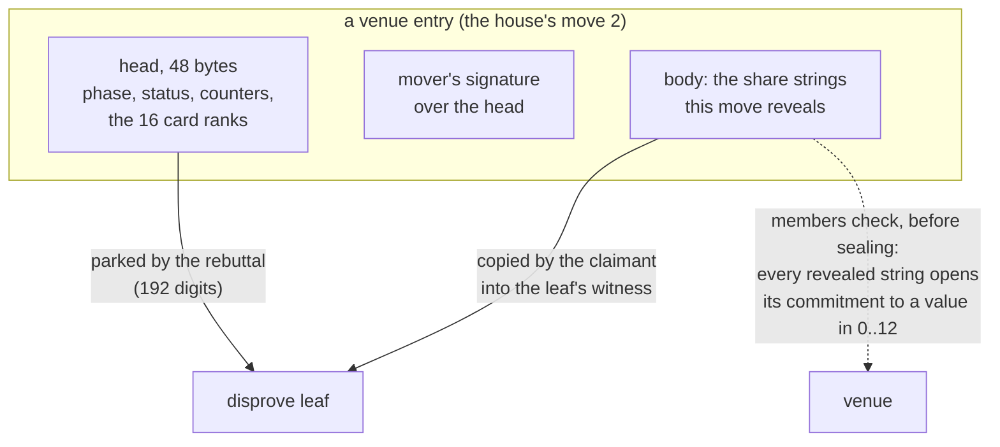

# Hidden cards in Script: blackjack's shares

Blackjack adds one thing to the [tic-tac-toe](tictactoe-predicates.md)
and [chess](chess-predicates.md) pattern: **inputs that don't fit in a
head.** Each card is the sum of two secret shares, one per party, and a
dispute has to open those shares in Script. This page shows where the
shares travel, how a leaf opens one without `OP_CAT`, and the leaf
`bj_card_2`, which catches a wrongly dealt card.

## Dealing a card from two shares

At open, for each of the 16 card positions `k`, the player commits to a
share `a_k` and the house to a share `b_k`, each in `0..12`. Card `k` is

```
rank_k = (a_k + b_k) mod 13          0 = ace, 1..8 = two to nine, 9..12 = ten-valued
```

Each share is uniform and fixed before the other is known, so the card is
uniform, and neither party knows it until both shares are revealed. For
every card the player reveals first and the house second, so the house
learns each card first; if it then refuses to reveal, that's a stall, and
a stall loses the pot.

## Committing without `OP_CAT`

The usual commitment, `hash(value ‖ salt)`, can't be opened in Script: the
opening would have to concatenate. The trick (from Andrychowicz et al.'s
Bitcoin lottery) hides the value in the **length** of a random string:

```
 share value v = 5
 s = 37 random bytes         ← 32 + v
 C = SHA256(s)               ← the commitment, exchanged at open

 opening in Script:   s  OP_SHA256 <C> OP_EQUALVERIFY      s really is the committed string
                      s  OP_SIZE  32 OP_SUB                 v = |s| − 32 = 5
```

The hash hides the length; a second opening of a different length would be
a SHA256 collision. It only works for small values, which a share is.

## Where the strings travel

A share string can't go through the parked heads: the heads arrive in a
leaf as nibbles, one per stack element, and rejoining 37 bytes from 74
nibbles is exactly the concatenation Script lacks. So the **cards** (one
rank nibble each) go in the head, and the **strings** go in the entry's
body.



The members' check is what makes the bodies trustworthy *as data*. An
entry missing a string it should reveal is not a move: honest members
neither seal it nor count it at its due time, so it's treated as a stall.
Whether the **cards** follow from the strings is the leaves' business, not
the members'.

## The head

```
 head digit   8       9      10      12,13   14,15   16..19     20..35          36..95
              action  phase  status  np      ds      lo, hi     card ranks      zero
                                     next    dealer  positions  k = 0..15,
                                     undealt stands  revealed   one nibble each
                                     position at     here
```

Positions 0 and 1 are the player's first cards, 2 the dealer's up-card,
15 the hole card, then the player's hits and the dealer's draws.

## A worked example: `bj_card_2`

The player's move 1 (DEAL) reveals its shares of positions 0–2. The house's
move 2 reveals its own shares of 0–2 and writes the three cards into its
head. Suppose the house cheats (the demo's **wrongcard** mode) and writes
the dealer's up-card one rank off:

| | value |
|---|---|
| player's share `a_2` (its string is 32 + 7 = 39 bytes) | 7 |
| house's share `b_2` (32 + 10 = 42 bytes) | 10 |
| the true card: (7 + 10) mod 13 | **4** (a five) |
| the card in the house's head, new head digit 20 + 2 | **5** (a six) |

`bj_card_2` fires iff *card 2 was dealt at this move, and it isn't the sum
of its shares mod 13.* Its witness carries the two strings below the usual
reveal pairs:

```
 witness, bottom to top:   s_player   s_house   195 (hash, digit) reveal pairs   σ_claimant
```

### The script

After the Winternitz verification (which parks the 192 digits), the leaf's
349 bytes run in four phases. The opcodes below are the real ones, from
`cargo run -p lngap-pos --example doc_scripts`.

**1. Load named values.** Bytes are rebuilt from digit pairs (`16h + l`):

```
182 OP_PICK  182 OP_PICK  181 OP_PICK OP_DUP OP_ADD ×4  181 OP_PICK OP_ADD  …
        prior phase, status, np, ds; then the same four for the new head
```

**2. Open both shares.** The strings sit below the reveal, at depth 204:

```
204 OP_PICK  OP_SHA256  <C_player,2>  OP_EQUALVERIFY      the player's string is genuine
204 OP_PICK  OP_SIZE  OP_NIP  32 OP_SUB                   a = 39 − 32 = 7
204 OP_PICK  OP_SHA256  <C_house,2>   OP_EQUALVERIFY      the house's string is genuine
204 OP_PICK  OP_SIZE  OP_NIP  32 OP_SUB                   b = 42 − 32 = 10
OP_OVER 0 13 OP_WITHIN OP_VERIFY                          a in 0..12
OP_DUP  0 13 OP_WITHIN OP_VERIFY                          b in 0..12
```

**3. Compute and compare:**

```
OP_OVER ×2  OP_ADD                                 a + b = 17
OP_DUP 13 OP_GREATERTHANOREQUAL  OP_IF 13 OP_SUB OP_ENDIF        mod 13 → 4
11 OP_PICK 2 OP_LESSTHANOREQUAL  2 8 OP_PICK OP_LESSTHAN  OP_BOOLAND
                                                   dealt here: prior np ≤ 2 < new np
88 OP_PICK  2 OP_PICK  OP_NUMNOTEQUAL              head card 5 ≠ computed 4
OP_BOOLAND                                         → 1: the leaf fires
```

There's no `OP_MOD`; a sum of two values below 13 needs at most one
subtraction, so one `OP_IF` does it.

**4. Clean up:**

```
OP_TOALTSTACK   OP_2DROP ×104   OP_FROMALTSTACK
```

The result is parked on the altstack, everything else is dropped (the 192
digits, the named values and the two strings), and the result comes back
as the only element. Here it's 1, so the spend succeeds. Had the card been
right, the leaf would end with 0 on the stack and the spend would fail.
(Tic-tac-toe's leaves end with `OP_VERIFY … OP_1` instead; same effect.)

On regtest this disprove confirms at about 4,900 vB, and it's what the
demo's wrongcard dispute ends with.

## The other leaves

The family is: `wrong_slot`; `bj_malformed`; `bj_transition` (an action
not allowed in this phase); `bj_counters` (np, ds, lo, hi not moved as the
action requires); `bj_cards_kept` (a dealt card changed); `bj_status` (a
wrong bust, showdown or push); `bj_dealer` (the dealer stops below 17, or
draws at 17 or above); and per position the `bj_share_k` (the mover
revealed a string that opens to a value above 12) and, at the house's
moves, the `bj_card_k` shown here. Only `bj_share_k` and `bj_card_k`
take witness strings; the others read the register file alone, as in
tic-tac-toe.
