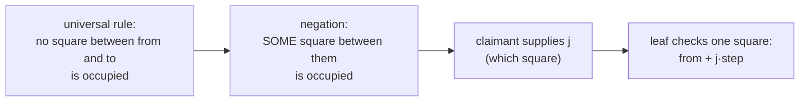
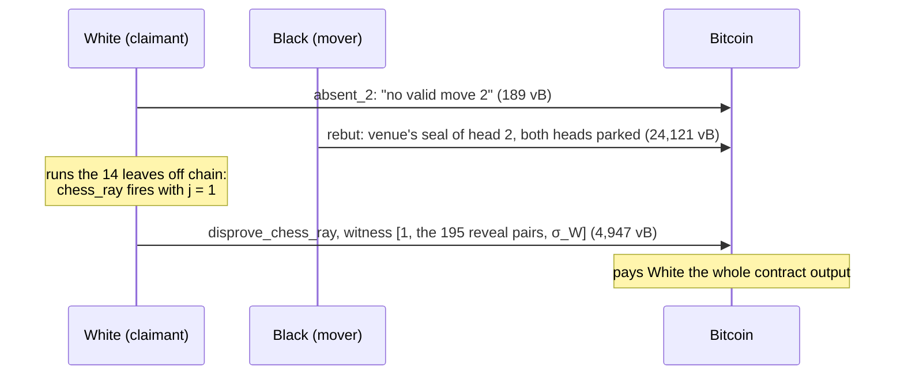

# Testing a chess rule in Script: exhibits

Chess uses the same machinery as [tic-tac-toe](tictactoe-predicates.md):
the mover's rebuttal parks two consecutive heads as a 192-digit register
file, and the claimant spends the one *disprove leaf* whose rule the move
broke. Two things are new in chess:

1. some rules can't be checked by reading a fixed digit (a piece's path
   depends on where it moves), so the leaf **computes square indices**
   and reads the board at them;
2. some rules are universal statements ("no square on the path is
   occupied"), and Script can't loop over all cases. The claimant
   **exhibits** the one counterexample instead, as an extra witness value.

## The register file

A chess head is 48 bytes: the first word identifies the entry, the second
holds the move, and the remaining 40 bytes are the whole position after it.

```
 a head (96 digits)                                   prior head: file digits 0..95
 ┌────────┬────────┬──────────────────────────────┐   new head:   file digits 96..191
 │ word0  │ word1  │ state (40 bytes)             │
 │ 0..7   │ 8..15  │ 16..95                       │   so the prior board starts at digit 16
 └────────┴────────┴──────────────────────────────┘   and the new board at digit 112

 state digits:  0..63   the board, one nibble per square (square s at digit s)
                64, 65  side to move (0 White, 1 Black)
                66, 67  castling rights
                68, 69  en passant square (64 = none)
                70, 71  halfmove clock
                72..75  the move's from and to squares
                76, 77  promotion piece
                78, 79  depth
```

Squares are numbered `s = file + 8·rank` (a1 = 0, h1 = 7, a8 = 56). A
square's nibble is 0 for empty, or a piece kind (1 pawn, 2 knight,
3 bishop, 4 rook, 5 queen, 6 king) plus 8 for Black.

## The family

Each leaf negates one statement that a legal move makes true. Each one is
about 14.6–15.1 KB, nearly all of it the shared Winternitz verification:

| leaf | fires iff | exhibit |
|---|---|---|
| `wrong_slot` | a head's first word isn't this game's, move and mover | — |
| `chess_malformed` | the new head isn't a well-formed encoding | — |
| `chess_mover` | from isn't the mover's piece, or that piece can't move that way | — |
| `chess_destination` | to holds the mover's own piece, or a pawn captures wrongly | — |
| `chess_ray` | a square strictly between from and to is occupied | `j`, which square |
| `chess_promotion` | a promotion is missing or misplaced | — |
| `chess_castling` | a castle without the right, the rook or the space | — |
| `chess_castlingattacked` | the king castles out of or through check | the attacker |
| `chess_kingattacked` | the mover's king is attacked after the move | the king, the attacker |
| `chess_board` | a square of the new board isn't what the move makes it | the square |
| `chess_side`, `…castlingfield`, `…epfield`, `…clock` | a bookkeeping field is wrong | — |

The exhibit is what keeps each leaf bounded. "The king is not in check" is
a statement about every enemy piece, but its falsification is *one*
attacker, which a leaf can verify directly.



A claimant that names the wrong square simply fails the leaf and tries
again before the window closes. The whole challenge space is about 4,400
(leaf, exhibit) pairs, searched off chain.

## A worked example: a bishop through a pawn

White plays 1.e4. Black then signs and publishes **c8–e6**: the bishop
moves along the diagonal through d7, which holds Black's own pawn. The new
board Black publishes is exactly what that move would produce, so nothing
in the bookkeeping is wrong; the move itself is illegal. (This is test
scenario PC6; the demo screenshot in the [README](../README.md) shows the
same kind of dispute.)

```
   8  r n b q k b n r        the bishop's path   c8 (58)
   7  p p p p . p p p                              │  step = −7
   6  . . . . . . . .                              d7 (51)  ← a black pawn
   5  . . . . p . . .                              │
   4  . . . . P . . .                              e6 (44)
      a b c d e f g h
```

The claimant runs the family off chain on the parked heads. Exactly one
leaf fires: `chess_ray`, with exhibit `j = 1`.

| file digit | value | meaning |
|---|---|---|
| 81 (prior side to move) | 1 | Black to move |
| 16 + 58 = 74 (prior c8) | 11 = 3 + 8 | a black bishop |
| 16 + 51 = 67 (prior d7) | 9 = 1 + 8 | a black pawn |
| 184, 185 (new from) | 3, 10 | from = 16·3 + 10 = 58 (c8) |
| 186, 187 (new to) | 2, 12 | to = 16·2 + 12 = 44 (e6) |

### The computation

Every chess leaf opens with the same arithmetic preamble, since Script has
no multiplication, division or bit operations:

```
byte from two digits      16h + l   = h doubled four times, plus l
rank of a square s        r = [s≥8] + [s≥16] + … + [s≥56]     (seven comparisons)
file                      f = s − 8r                          (8r by three doublings)
colour, kind of a nibble  c = [n≥8],  k = n − 8c
read the board at s       <base> OP_SWAP OP_SUB OP_PICK       (s range-checked first)
```

For our move: `r(58) = 7, f(58) = 2, r(44) = 5, f(44) = 4`, so
`Δf = 2, Δr = −2`, and the prior nibble at 58 is 11, a black bishop.
The body of `chess_ray`:

```
guard  := (Δf = 0 or Δr = 0 or |Δf| = |Δr|)  and not a knight
          and 1 ≤ j < max(|Δf|, |Δr|)
step   := sign(Δf) + 8·sign(Δr)                         = 1 + 8·(−1) = −7
sq     := from;  for i in 1..6: if i ≤ j: sq := sq + step   (six gated additions)
                                                        = 58 − 7 = 51  (d7)
result := guard and prior[sq] ≠ 0                       = prior nibble 9 ≠ 0  → 1
```

There are no loops in Script, so "walk j squares" is six additions, each
switched on or off by comparing `i` with `j`. The maximum ray is seven
squares, so six steps strictly between suffice. The leaf ends as in
tic-tac-toe: `OP_VERIFY` on the result, then drop the file and leave `OP_1`.

### The spend



The `chess_board` leaf would *not* fire here, whatever square White named:
the new board is the honest consequence of the claimed move. The test
`pos_chess_graph` checks that rejection before mining the ray disprove.
Each leaf catches its own kind of illegality.

## Why disprove rather than prove

Proving a chess move legal in Script would mean checking every rule in one
script, including universal ones like "the king is not in check", which
need every enemy piece examined. Disproving needs only the one broken rule,
plus one witness value where the rule is universal. The family was
checked for **soundness** (a legal move with its honest successor fires no
leaf: tested over every legal move from many positions) and
**completeness** (any other tuple fires some leaf: fuzzed against an
independent move generator).

The long paper's appendix (`docs/paper/lngap_draft.pdf`, *The chess
disprove family, in full*) lists every predicate's digit layout and shows
this disproof opcode by opcode.
