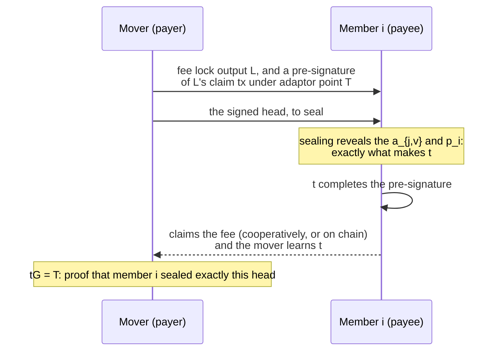

# EC-OTS: how Script reads what the venue sealed

A rebuttal has to prove to Script that the venue **sealed** the mover's
head. The venue's members can't sign the head with ordinary Schnorr
signatures, because Script can't verify those over an arbitrary message.
Instead the venue uses what we call an **elliptic-curve one-time
signature (EC-OTS)**: the same one-time idea as
[Winternitz](winternitz.md), with curve points in place of hash chains.
This page shows the table the venue publishes, the script fragment that
reads it, and why curve points (rather than hashes) let the mover pay the
sealer atomically.

## The table: one point per digit value

For every move of every contract, the venue publishes in advance a
**content table**: for each digit position `j` of the head (96 nibbles)
and each possible value `v` (16), an *anticipation point*

```
A_{j,v} = R_{j,v} + e_{j,v}·X        X = xG, the venue's content key
                                     R_{j,v} = r_{j,v}G, a nonce for this (j, v) alone
                                     e_{j,v} = H(R_{j,v}, X, ⟨contract, move, j, v⟩)
```

```
              v = 0      v = 1      v = 2     …     v = 15
   j = 0     A_{0,0}    A_{0,1}    A_{0,2}    …    A_{0,15}
   j = 1     A_{1,0}    A_{1,1}  ▶A_{1,2}◀   …    A_{1,15}       a head 0x52…
   j = 2     A_{2,0}    A_{2,1}    A_{2,2}    …    A_{2,15}       selects one point
   …                                                              per row
   j = 95    A_{95,0}   …                          A_{95,15}
```

**Sealing** a head means revealing, for each row, the discrete log of the
point that row's digit selects:

```
a_{j,v} = r_{j,v} + e_{j,v}·x          a_{j,v}·G = A_{j,v}
```

That scalar is a Schnorr signature (nonce `R_{j,v}`) on the statement
"digit `j` holds `v`", and at the same time a **private key** for the point
`A_{j,v}`. The second property is the one Script uses.

The content key `x` is shared by all the members, so any one of them can
seal (1 of n). Every value has its own nonce, so revealing two values in
one row doesn't leak `x`; it is an **equivocation**, provable by anyone
holding both scalars, since each checks against its published point.

## Reading it in Script: possession, not verification

Script never verifies these signatures. It checks **possession**: the
spender signs the rebuttal transaction itself, using each revealed
`a_{j,v}` as a private key, and an `OP_CHECKSIG` under `A_{j,v}` succeeds
exactly when the venue revealed that scalar.

The digit `v` that selects the point comes from the stack: the mover's
[Winternitz](winternitz.md) signature has just parked the head's digits.
The readout fragment for one row (549 bytes: 16 points of 33 bytes, plus
20 opcodes):

```
OP_FROMALTSTACK                       the parked digit v
<A_{j,0}> <A_{j,1}> … <A_{j,15}>      the row's sixteen points
16 OP_PICK 15 OP_SWAP OP_SUB OP_PICK  select A_{j,v}
18 OP_ROLL OP_SWAP OP_CHECKSIGVERIFY  the witness signature under it
OP_2DROP ×8  OP_DROP                  drop the points and the digit
```

A trace for `v = 2`, with the witness signature `sig_j` on the stack:

```
 sig_j                                                 (witness; v is on the altstack)
 sig_j  2                                              OP_FROMALTSTACK
 sig_j  2  A₀ A₁ … A₁₅                                 16 pushes
 sig_j  2  A₀ … A₁₅  2                                 16 OP_PICK      copy v
 sig_j  2  A₀ … A₁₅  13                                15 OP_SWAP OP_SUB   15 − v
 sig_j  2  A₀ … A₁₅  A₂                                OP_PICK         A₁₅ is 0 deep, A₂ is 13 deep
 2  A₀ … A₁₅  A₂  sig_j                                18 OP_ROLL      fetch the signature
 2  A₀ … A₁₅  sig_j  A₂                                OP_SWAP
 2  A₀ … A₁₅                                           OP_CHECKSIGVERIFY: sig_j valid under A₂?
 (empty)                                               OP_2DROP ×8, OP_DROP
```

**The tie is by construction.** The digit that selects the point *is* the
digit the mover signed. If the mover's parked head differs from the sealed
one in any digit, that row selects a point whose secret nobody revealed,
no valid signature exists, and the leaf fails. So the readout proves "the
venue sealed exactly the head the mover committed to", one witness element
per row.

The rebuttal reads out the 96 digits of the **new** head this way:
about 53 KB of script constants, most of the rebuttal's 24 kvB. (The
prior head is bound by the claimant's own signature instead, since only its
content matters, not whether the venue published it.)

## One-bit statements: proposers and flags

A table costs 96 × 16 points because it attests 96 nibbles. A statement
with no content, a single bit, costs **one point** per member:

| point | the member reveals its secret when | read by |
|---|---|---|
| proposer point `P_{i,(c,d)}` | it seals move `d` | `rebut`: names the sealer |
| flag point `F_{i,(c,d)}` | move `d` wasn't sealed by its due time | `not_timely`: counts flags |

In the rebuttal, a **proposer fragment** selects one member's point by a
witness index and requires a signature under it, so every rebuttal names
the member whose seal it relies on:

```
<P₀> <P₁> <P₂> <P₃> <P₄>             the five members' points for this move
5 OP_PICK  4 OP_SWAP OP_SUB OP_PICK  select P_i by the witness index i (0..4)
7 OP_ROLL  OP_SWAP OP_CHECKSIGVERIFY a signature under P_i
OP_2DROP ×3                          drop the points and the index
```

`not_timely` counts with `OP_CHECKSIGADD` instead: a signature under each
flag point whose secret was revealed, an empty element for the others, and
the leaf passes if the count reaches the majority threshold.

## Why curve points: the fee lock

A hash-based table would work for Script just as well. The reason for
points is **payment**. Points add, so the sealing of a whole head by a
particular member collapses into one point:

```
C_h = Σ_j A_{j,v_j}            the head's content point (c_h = Σ_j a_{j,v_j})
T   = C_h + P_{i,(c,d)}        ... plus member i's proposer point
t   = c_h + p_{i,(c,d)}        known exactly when member i seals exactly this head
```

`T` is an ordinary adaptor point, so the mover can pay the member for
sealing, atomically:



Hash preimages don't add, so a lock on "this whole head, sealed by this
member" would need a special output checking every preimage in Script,
not a single point a payment can be locked to. This is the shape of a
Discreet Log Contract: anticipation points published in advance, and an
outcome ("this head was sealed, by this member") that completes a
transaction.

The fee lock is built and tested in a channel (scenarios FL1–FL4); the
demos don't charge fees.
