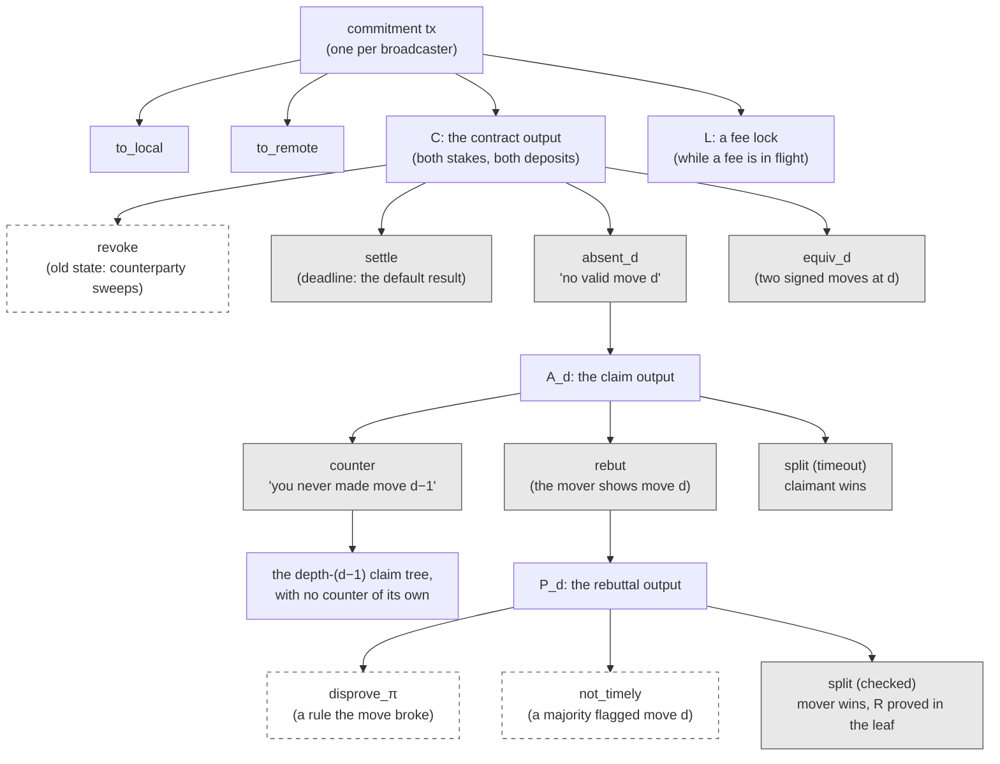
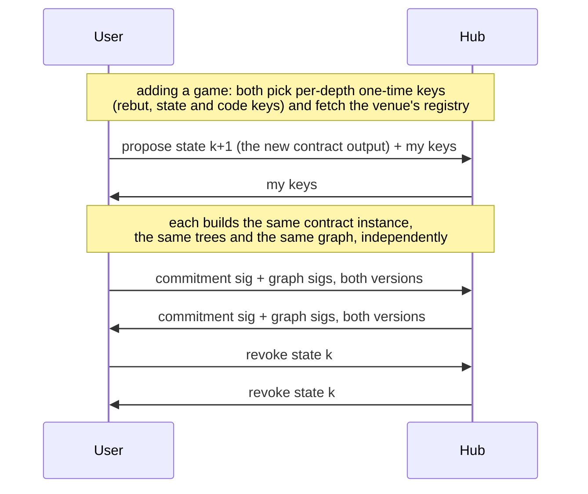
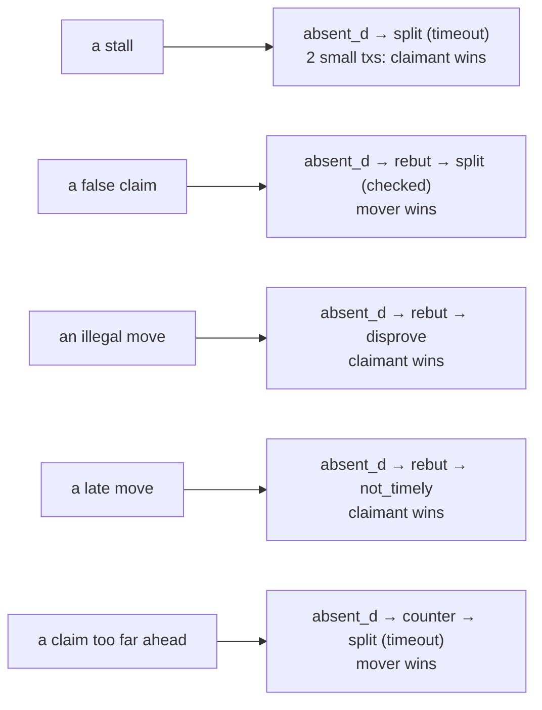

# The pre-signed dispute graph in a Lightning channel

A contract lives in a channel as one more output of the commitment
transaction, beside the two balances. Whatever happens in a dispute has to
be decided **in advance**: Bitcoin has no covenants, so the only way to
force "this output may only be spent into that one" is for both parties to
sign the spending transaction ahead of time. This page shows the graph of
transactions hanging off a contract output, which of them are pre-signed
and why, and what a channel update exchanges.

## The graph



Grey: **pre-signed** by both parties at every channel update. Dashed:
**built at dispute time** by one party. Each arrow out of an output is a
leaf of that output's taproot tree; each grey box is a transaction whose
outputs were fixed when it was signed.

There is one `absent_d` per move `d = 1..M`, each with its own claim
output, rebuttal, counter and splits. A dispute uses one path through
this graph: at most a claim, a counter, a rebuttal and one final spend,
whatever the length of the game.

## Who signs what, and why

The rule is simple:

> A transaction is **pre-signed** if it must send funds to a *fixed next
> output*. It's **built at dispute time** if it pays the spender, who is
> then the rightful winner and may write its own outputs.

| transaction | leaf | why |
|---|---|---|
| `absent_d`, `counter`, `rebut`, the splits, `equiv_d`, `settle` | 2-of-2 | each must land in a specific tree (or pay a specific split): the counterparty's signature, given in advance, is what pins the outputs |
| `disprove_π`, `not_timely` | the claimant's key, after a window | they pay the claimant the whole output; nothing needs pinning |
| `revoke` | revocation secret + counterparty key | Lightning's penalty |

**Why the counterparty's signature, specifically.** Taproot's signature
hash commits to the transaction's outputs. A pre-signed transaction is
"pinned" only if it needs a signature from someone who *wouldn't* sign
anything else, which is the party the transaction protects. The
rebuttal is the cautionary case: it was once gated by the **mover's**
key alone. Every other key in its witness is also the mover's (the
venue's revealed readout scalars, the proposer scalar), so the mover could
redirect the claim output to itself and skip the disprove stage. It's
2-of-2 now; the test `rebut_cannot_redirect_the_claim_output` keeps it
that way.

## The timelocks

```
 move d due at T_d = t₀ + d·ℓ                       (wall-clock, kept by the venue)
 absent_d     CLTV: median-time-past ≥ T_d + m      the only read of Bitcoin's clock
 ───────────────────────────────────────────────────────────────────────────────
 A_d   rebut, counter     immediately              the mover answers within δ
       split (timeout)     CSV δ                    nobody answered: claimant wins
 P_d   disprove, not_timely  CSV δ                  the claimant's window
       split (checked)       CSV δ + δ′              after every disprove has had its chance
 C     leaves the broadcaster can spend: + CSV Δ (to_self_delay), so a revoked
       commitment's C is swept by `revoke` before anything else can spend it
```

`δ` and `δ′` are relative timelocks in blocks. Block granularity only slows
a resolution; the per-move clock itself runs at the venue's pace.

## What a channel update exchanges

Every channel state has **two commitment transactions**, one per
broadcaster, so the graph exists twice: the outpoints differ, and the
`to_self_delay` sits on different leaves. Both parties sign every grey
transaction of both versions, and send the signatures in the same message
as the commitment signature.



If the two sides compute different graphs (different keys, a different
registry), the signatures simply fail to verify and the update is refused.
Agreement is checked by construction, not negotiated.

**Moves are not channel updates.** Once the contract is in the channel,
its graph covers every depth. A move is an entry the mover signs and the
venue seals; the opponent signs nothing. Updates happen only to add a
contract, to settle it, for fee locks, and for ordinary payments. Each new
commitment re-signs the same graph against its own outpoints.

## How big it is

Per commitment version, with `M` moves (chess has no exhibit family;
tic-tac-toe adds four transactions per depth from 5):

```
 1                      settle
 + M × (1 + 1 + 3 + 3)  per depth: the claim, the rebuttal, 3 timeout splits, 3 checked splits
 + M                    per depth: equiv_d
 + (M−1) × (1+1+3+3)    per depth from 2: the counter, its rebuttal, its splits
```

| game | M | transactions per version | signatures per update |
|---|---|---|---|
| tic-tac-toe | 9 | 166 | 664 |
| chess (the demo's default) | 50 | 843 | 3,372 |
| the Groth16 verifier search | 119 | 2,058 | 8,232 |

Signing is cheap (a few milliseconds per hundred transactions). What costs
time is building the leaves: each rebuttal script is about 70 KB and has
to be hashed into its tree. The trees depend only on the contract's keys,
so they're built once per contract and cached; later updates only re-sign.

## Where the money goes



Every resolution pays the winner the whole output, both stakes **and
both dispute deposits**, so whoever deviated pays for the transactions.
The cooperative path returns each deposit to its owner and splits only the
stakes, with no transaction on chain.

See also: [the venue's attestations](ec-ots.md), [how data crosses the
graph](winternitz.md), and the games' disprove families
([tic-tac-toe](tictactoe-predicates.md), [chess](chess-predicates.md),
[blackjack](blackjack-shares.md)).
