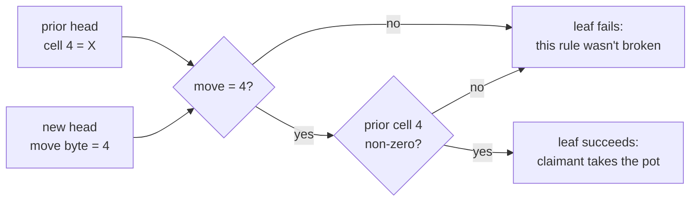

# Testing a game rule in Script: tic-tac-toe

Tic-tac-toe is the smallest game in the repository, so it's the clearest
place to see the pattern every game reuses: **a move is judged on chain by a
*disprove leaf*, a small script that succeeds only if one particular rule
was broken.** This page follows one leaf, `cell_occupied_4`, from the board
down to the opcodes.

## Where the move comes from

In a dispute the mover has already answered an absence claim with a
*rebuttal* (which the claimant is now trying to disprove, below; see the
short paper for the outline logic). The rebuttal put
two consecutive venue entries on chain under its one-time Winternitz key:
the head before its move and the head after it
([the pre-signed graph](presigned-graph.md) shows where this happens).
Re-verifying that signature leaves the 96 bytes of the two heads on the
stack as **192 nibbles**, one stack element each. Everything a leaf knows
about the game comes from these 192 numbers, which the code calls the
*register file* ([Winternitz](winternitz.md) explains how they get there).

```
 register file (192 digits, one nibble per stack element)
 ┌──────────────── prior head: digits 0..95 ────────────────┬──────────────── new head: digits 96..191 ─────────────┐
 │ word0  │ move │ state       │  (unused padding)          │ word0  │ move │ state       │  (unused padding)     │
 │ 0..7   │ 8, 9 │ 10..15      │  16..95                    │ 96..103│104,  │ 106..111    │  112..191             │
 │        │      │             │                            │        │ 105  │             │                       │
 └──────────────────────────────────────────────────────────┴───────────────────────────────────────────────────────┘
   digit 191 is on top of the stack; digit 0 is deepest
```

A tic-tac-toe head packs the game into three state bytes (24 bits):

```
 cells, 2 bits each (0 empty, 1 X, 2 O)          state bits:  20 19 │18 │17 ... 0
                                                               status │turn│ cell 8 ... cell 0
     0 │ 1 │ 2
    ───┼───┼───        state nibble k = bits 4k..4k+3, stored at head digit 15 - k
     3 │ 4 │ 5         cell i lives in nibble i/2: the low 2 bits for even i,
    ───┼───┼───                                     the high 2 bits for odd i
     6 │ 7 │ 8         so cell 4 is the low half of nibble 2, at head digit 13
```

The move itself is one byte, the cell index, at head digits 8 (high
nibble) and 9 (low nibble).

## The rule, and its negation

The rule is "you may only mark an empty cell". A disprove leaf encodes its
**negation**, the thing a claimant can show:

> `cell_occupied_4` fires iff the new head's move is cell 4 **and** cell 4
> was already marked in the prior head.



There's one such leaf per cell, plus leaves for the other rules (wrong
turn, board not updated correctly, wrong status, and so on): about thirty
for tic-tac-toe. A legal move fires none of them; any illegal one fires at
least one. The claimant runs them all off chain and spends the one that
fires.

## A worked example

X (the user) opens in the centre at move 1. O (the hub) answers at move 2
by "playing" the centre too: an illegal move that O signs anyway.

| register-file digit | value | meaning |
|---|---|---|
| 13 (prior state nibble 2) | `1` | cell 4 = X, cell 5 = empty |
| 104 (new move, high) | `0` | |
| 105 (new move, low) | `4` | the move is cell 4 |

## The script

This is the leaf's script after the Winternitz verification, exactly as the
code builds it (`cargo run -p lngap-pos --example doc_scripts` prints it).
It has three phases: **gather** the inputs, **compute** the predicate,
**clean up**.

### 1. Gather

`OP_PICK n` copies the element `n` deep. With the 192 digits on the stack,
digit `j` is `191 - j` deep, so:

```
178 OP_PICK  OP_TOALTSTACK     copy digit 13  (prior nibble 2)   -> altstack
87  OP_PICK  OP_TOALTSTACK     copy digit 104 (move, high)       -> altstack
86  OP_PICK  OP_TOALTSTACK     copy digit 105 (move, low)        -> altstack
OP_FROMALTSTACK ×3             bring them back
1 OP_ROLL  2 OP_ROLL           reorder
```

Each copy goes straight to the altstack, so the depths stay fixed while
gathering (thus, use of the altstack is not actually necessary in this case; it does make the bookkeeping with indices easier, though). Afterwards the three inputs sit on top of the untouched file:

```
 stack (top on the right):   … 192 digits …  nib=1  hi=0  lo=4
```

### 2. Compute

```
4 OP_NUMEQUAL         … nib  hi  (lo==4)=1
OP_SWAP               … nib  1   hi
0 OP_NUMEQUAL         … nib  1   (hi==0)=1
OP_BOOLAND            … nib  1                 the move is cell 4
OP_SWAP               … 1    nib
<split4>              … 1    hi2  lo2          nib = 4·hi2 + lo2  →  1 = 4·0 + 1
OP_NIP                … 1    lo2=1             cell 4 = the low half
OP_0NOTEQUAL          … 1    1                 cell 4 is marked
OP_BOOLAND            … 1                      both: the rule was broken
```

Script has no division or bit operations, so `split4` (see in code [here](https://github.com/AdamISZ/ln-gap/blame/0a9049ac291cf1b8cff1d8767d0da081c29842cd/crates/apps/pos/src/ttt.rs#L192)) takes a nibble apart
with comparisons and doublings: is it ≥ 8? subtract 8 and remember the
bit; is the rest ≥ 4? subtract 4 and remember that bit; reassemble the high
pair as 2·b₃ + b₂ and keep the low pair. It's 28 opcodes, and the same
gadget reads turn bits and status bits in the other leaves.

### 3. Clean up

```
OP_VERIFY             fails the spend unless the predicate was true
OP_2DROP ×96          drop the 192-digit register file
OP_1                  tapscript requires exactly one true element at the end
```

`OP_VERIFY` is what makes this a *disprove* leaf: if cell 4 was empty, or
the move wasn't cell 4, the spend is invalid and the claimant tries another
leaf. The whole predicate is 156 bytes. The leaf is 14,408 bytes, because
the Winternitz verification in front of it (shared by every leaf) is
about 14.2 KB.

As per the script snippet above, taproot has something called "cleanstack", by consensus of BIP342: a Script does not pass because its top element is truthy; you are not allowed to have any other elements on the stack at the end, leading to the amusing spectacle of a huge number of repeated `OP_2DROP` opcodes at the end to get rid of what remains (the "register file"). In this case, since the witness is so large, this extra 96 bytes is not problematic.

## The spend

On chain the leaf sits in the rebuttal output's taproot tree, behind a
timelock and the claimant's key:

```
<δ> OP_CSV OP_DROP  <P_claimant> OP_CHECKSIGVERIFY     only the claimant, after the window
WOTS-VERIFY(rebuttal key)                                 re-parks the 192 digits
… the predicate above …
```

Its witness is the claimant's signature and the mover's 195 (hash, digit)
reveal pairs, which the claimant copies from the rebuttal's witness on
chain. It needs nothing from the mover, and nothing from the venue.

## What carries over to the other games

- **Disprove, don't prove.** Each leaf checks one way of breaking one rule.
  Proving legality would need the whole rule set in one script; disproving
  needs only the one rule that was broken.
- **The register file.** Every game's leaves read the same 192 parked
  digits; only the meaning of the digits changes.
- **Gather, compute, clean up.** Chess and blackjack leaves have the same
  three phases, with bigger compute phases.

Next: [chess](chess-predicates.md), where a single rule needs a hint from
the claimant (an *exhibit*), and [blackjack](blackjack-shares.md), where
some inputs come from outside the register file.
